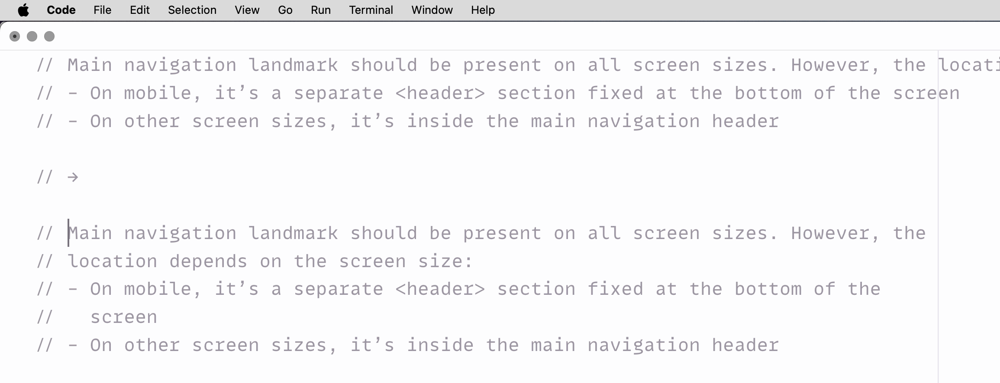

# Grim Wrapper 🪦

Minimalist comment, Markdown, and plain text wrapping.

**Install from [Visual Studio Marketplace](https://marketplace.visualstudio.com/items?itemName=sapegin.grim-wrapper) or [Open VSX Registry](https://open-vsx.org/extension/sapegin/grim-wrapper)**

[](https://sapegin.me/book/)



## Features

- Very minimal and fast.
- Works in most popular programming languages, Markdown, and plain text.
- Supports Markdown lists and JavaDoc/JSDoc/XMLDoc tags.
- Limited scope to a single paragraph (part of a comment separated by empty lines).
- Almost zero config: the only option is maximum line length.
- Doesn’t pollute the editor with too many commands and hotkeys.

## Commands

You can either run this commands from the Command Palette (<kbd>Cmd</kbd>+<kbd>Shift</kbd>+<kbd>P</kbd> on a Mac, or <kbd>Ctrl</kbd>+<kbd>Shift</kbd>+<kbd>P</kbd> on Windows).

| Description | Name | Default Mac | Default Windows |
| --- | --- | --- | --- |
| Rewrap comment or text | `grimWrapper.wrapText` |  |  |

## Settings and keybinding

You can change the following options in the [Visual Studio Code setting](https://code.visualstudio.com/docs/getstarted/settings):

| Description | Setting | Default |
| --- | --- | --- |
| Controls maximum length of lines in characters | [grimWrapper.maxLength](vscode://settings/grimWrapper.maxLength) | 80 |

You can define `maxLength` for each language separately:

```json
{
  "[python]": {
    "grimWrapper.maxLength": 72
  },
  "[javascript]": {
    "grimWrapper.maxLength": 90
  }
}
```

This extension doesn’t define any hotkeys, but you can [define the keybinding](https://code.visualstudio.com/docs/getstarted/keybindings) for the command above.

## Changelog

The changelog can be found on the [Changelog.md](./Changelog.md) file.

## How is it different from other extensions?

I’ve been using [Rewrap](https://stkb.github.io/Rewrap/) for a long time, but it doesn’t always do what I want:

- No support for JSX comments.
- Often weird formatting of multiline comments (`/* ... */`, etc.).
- I don’t like the way it format Markdown todos and JSDoc tags.

Check out [samples](https://github.com/sapegin/vscode-grim-wrapper/tree/main/samples) to get an idea how it formats comments.

## You may also like

Check out my other Visual Studio Code extensions:

- [Just Blame](https://marketplace.visualstudio.com/items?itemName=sapegin.just-blame): Git Blame annotations, inspired by JetBrains editors
- [Emoji Console Log](https://marketplace.visualstudio.com/items?itemName=sapegin.emoji-console-log): insert `console.log()` statements with a random emoji
- [Mini Markdown](https://marketplace.visualstudio.com/items?itemName=sapegin.mini-markdown): minimalist kit for comfortable Markdown writing: commands, hotkeys, autocomplete
- [New File Now](https://marketplace.visualstudio.com/items?itemName=sapegin.new-file-now): create new files from the command palette
- [Notebox](https://marketplace.visualstudio.com/items?itemName=sapegin.notebox): take quick notes in the bottom panel
- [Todo Tomorrow](https://marketplace.visualstudio.com/items?itemName=sapegin.todo-tomorrow): highlight `TODO`, `HACK`, `FIXME`, etc. comments
- [Reveal in Ghostty](https://marketplace.visualstudio.com/items?itemName=sapegin.reveal-in-ghostty): reveal current project or folder in Ghostty
- [Reveal in Nimble Commander](https://marketplace.visualstudio.com/items?itemName=sapegin.reveal-in-nimble-commander): reveal current project or folder in Nimble Commander
- [Squirrelsong Light Theme](https://marketplace.visualstudio.com/items?itemName=sapegin.Theme-SquirrelsongLight): low contrast non-distracting light theme for web developers
- [Squirrelsong Dark Theme](https://marketplace.visualstudio.com/items?itemName=sapegin.Theme-SquirrelsongDark): low contrast non-distracting dark theme for web developers

## Sponsoring

This software has been developed with lots of coffee, buy me one more cup to keep it going.

<a href="https://www.buymeacoffee.com/sapegin" target="_blank"></a>

## Contributing

Bug fixes are welcome, but not new features. Please take a moment to review the [contributing guidelines](Contributing.md).

## Authors and license

[Artem Sapegin](https://sapegin.me), and [contributors](https://github.com/sapegin/vscode-grim-wrapper/graphs/contributors).

MIT License, see the included [License.md](License.md) file.
